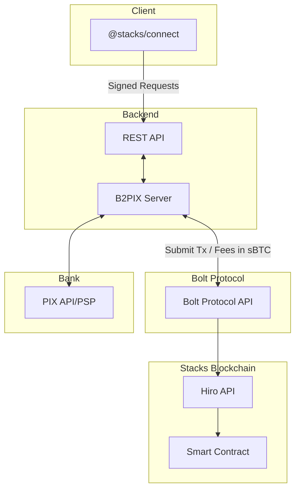

<p align="center">
  
</p>

# B2PIX - Bitcoin PIX Exchange

## Overview

**B2PIX** is a privacy-focused, automated P2P Bitcoin exchange platform that bridges traditional Brazilian banking (PIX) with Bitcoin. Users can buy and sell Bitcoin directly with each other using instant PIX transfers, all while maintaining custody of their funds through smart contracts on the Stacks blockchain.


## App & Social

- **App**: https://b2pix.org
- **X/Twitter**: https://x.com/b2pixorg
- **Telegram**: https://t.me/+XGmtL15A4BszMmQx
- **Instagram**: https://www.instagram.com/b2pix_

### Key Features

- **Non-Custodial Trading**: Your Bitcoin stays in your wallet until the trade is completed
- **PIX Integration**: Instant Brazilian real transfers using PIX payment system
- **Stacks Blockchain**: Built on Bitcoin's most advanced layer-2 solution
- **sBTC Support**: Trade with synthetic Bitcoin (sBTC) for faster, cheaper transactions
- **Privacy First**: Invite-only platform with minimal data collection
- **Fee UX via Bolt:** Pay Stacks tx fees in **sBTC** (Bolt Protocol) for simpler UX.  
- **PIX API Integration**: Server-side integration with bank/PSP PIX APIs for payment verification

## 🎯 How It Works

1. **Get Invited**: Request an invitation to join the platform
2. **Connect Wallet**: Link your Stacks-compatible wallet
3. **Setup PIX**: Configure your Brazilian bank account
4. **Trade Bitcoin**: Buy or sell Bitcoin with other users

---

##  Single‑Token UX via Bolt Protocol (No STX Required)

A key UX feature of **B2PIX** is **no dual‑token requirement** on Stacks. New users don’t need **STX** to pay transaction fees — they can use a **fresh wallet** and operate **only with sBTC**:

- **Fees in sBTC:** All contract calls can pay network fees in **sBTC** instead of STX.  
- **No STX setup friction:** Users can acquire sBTC and transact immediately without preloading STX.  
- **Powered by Bolt Protocol:** This is enabled by the **Bolt Protocol**, which allows Stacks fees to be paid in sBTC. See: https://github.com/ronoel/bolt-protocol

> Result: simpler onboarding and a Bitcoin‑native UX focused on sBTC.


## Architecture

### Architecture Diagram





- **Frontend (Angular):** Requires a SIP‑030 Stacks wallet and uses `@stacks/connect` for authentication and transaction signing.
- **Backend (Rust):** Event‑driven services (orders, escrow, PIX). Communicates with the **Bolt Protocol API** to interact with the Stacks blockchain and enable **fees in sBTC** (no STX required).
- **PIX Integration:** The server communicates with Brazilian **PIX APIs** (banks/PSPs) to verify incoming payments.
- **Signed FrontBack Communications:** All requests from the frontend to the backend carry **messages signed by the user’s SIP‑030 wallet**, providing origin authentication and replay protection.

### Payment Verification Flow

```
  BUYER                       BACKEND                      SELLER
    │                            │                            │
    │ 1. Send BRL via PIX        │                            │
    │    to seller's PIX key     │                            │
    │                            │                            │
    │ 2. Mark as Paid            │                            │
    │                            │                            │
    │───────────────────────────▶│                            │
    │                            │ 3. Verify                  │
    │                            │    - Check PIX transaction │
    │                            │    - Verify amount         │
    │                            │                            │
    │                            │ 4. Update Buy Status       │
    │                            │    PAID  PAYMENT_CONFIRMED │
    │                            │                            │
    │                            │ 5. Notify Seller           │
    │                            │───────────────────────────▶│
    │                            │                            │
    │                            │ 6. Release sBTC            │
    │◀───────────────────────────┤    (Bolt to Stacks)        │
    │    Bitcoin received        │                            │
    │                            │                            │
```


## Smart Contracts

### Escrow Contract (Addresses & Functions)

**Contract address — Testnet**  
`ST3QZNX3CGT6V7PE1PBK17FCRK1TP1AT02W1N0YJF.boltproto-sbtc-rc-2-0-0`

**Contract address — Mainnet**  
`SP3QZNX3CGT6V7PE1PBK17FCRK1TP1AT02ZHQCMVJ.boltproto-sbtc-v2`

**Functions used by B2PIX trade flow**  
- **Lock seller sBTC:** `transfer-stacks-to-bolt`  
- **Release to buyer:** `transfer-bolt-to-stacks`

### Trust & Assumptions

- **On-chain truth:** Asset custody and state are enforced by Clarity contracts.  
- **Off-chain signal:** PIX “payment received” is verified off-chain (bank app/PSP event).  
- **Disputes / timeouts:** If no valid confirmation before expiry, send refunds to the seller.
