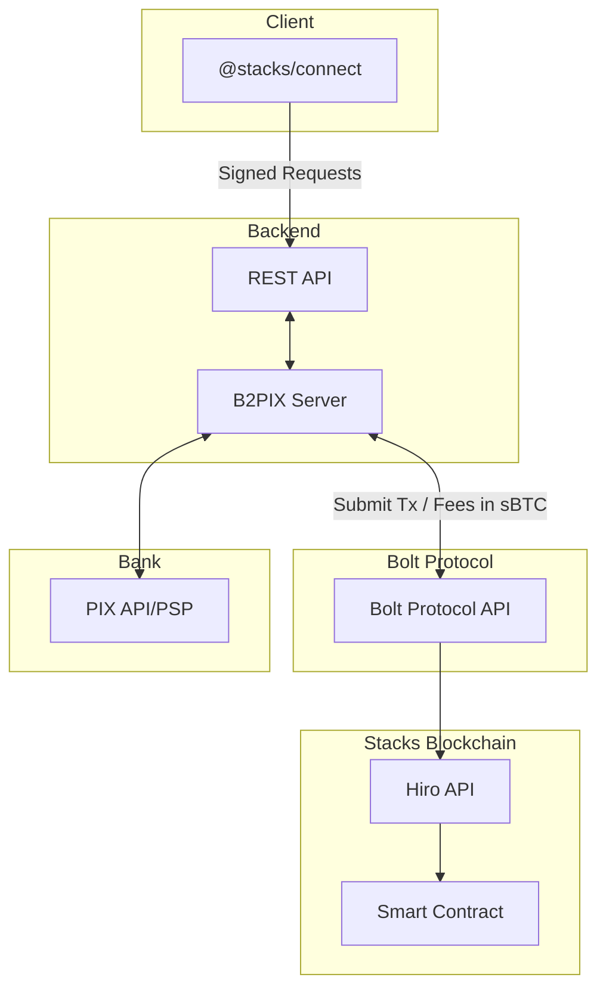

<p align="center">
  
</p>

# B2PIX - Bitcoin PIX Exchange

## Overview

**B2PIX** is a privacy-focused, automated P2P Bitcoin exchange platform that bridges traditional Brazilian banking (PIX) with Bitcoin. Users can buy and sell Bitcoin directly with each other using instant PIX transfers, all while maintaining custody of their funds through smart contracts on the Stacks blockchain.


## App & Social

- **[Website](https://b2pix.org)**
- **[Video Demo](https://www.youtube.com/watch?v=lZwk6rVDvzI)**
- **[X/Twitter](https://x.com/b2pixorg)**
- **[Telegram](https://t.me/+XGmtL15A4BszMmQx)**
- **[Instagram](https://www.instagram.com/b2pix_)**


Watch our demonstration video that showcases how B2Pix works:

[](https://youtu.be/lZwk6rVDvzI)

### Key Features

- **PIX Integration**: Instant Brazilian real transfers using PIX payment system.
- **Stacks Blockchain**: Built on Bitcoin's most advanced layer-2 solution.
- **sBTC Support**: Trade with synthetic Bitcoin (sBTC) for faster, cheaper transactions.
- **Privacy First**: Invite-only platform with minimal data collection.
- **Fee UX via Bolt:** Pay Stacks tx fees in **sBTC** (Bolt Protocol) for simpler UX.
- **PIX API Integration**: Server-side integration with bank/PSP PIX APIs for payment verification.
- **Embedded Wallet**: Built-in non-custodial wallet available in the dApp — users can **create** a new wallet or **import** an existing one (seed / mnemonic), with keys stored encrypted in the browser and optional encrypted backup/export.
- **Email Notifications**: Transactional e-mail alerts (e.g., purchase completed, sale completed, payment confirmed).


## 🎯 How It Works

1. **Get Invited**: Request an invitation to join the platform
2. **Connect Wallet**: Link your Stacks-compatible wallet
3. **Setup PIX**: Configure your Brazilian bank account
4. **Trade Bitcoin**: Buy or sell Bitcoin with other users

---

##  Single‑Token UX via Bolt Protocol (No STX Required)

A key UX feature of **B2PIX** is **no dual‑token requirement** on Stacks. New users don't need **STX** to pay transaction fees — they can use a **fresh wallet** and operate **only with sBTC**:

- **Fees in sBTC:** All contract calls can pay network fees in **sBTC** instead of STX.
- **No STX setup friction:** Users can acquire sBTC and transact immediately without preloading STX.
- **Powered by Bolt Protocol:** This is enabled by the [**Bolt Protocol**](https://github.com/ronoel/bolt-protocol), which allows Stacks fees to be paid in sBTC.

**Bolt Protocol Resources:**
- [GitHub Repository](https://github.com/ronoel/bolt-protocol)
- [Contract Source Code](https://github.com/ronoel/bolt-protocol/blob/main/bolt-protocol-contracts/contracts/boltproto-sbtc.clar)
- [Mainnet Contract Explorer](https://explorer.hiro.so/txid/SP3QZNX3CGT6V7PE1PBK17FCRK1TP1AT02ZHQCMVJ.boltproto-sbtc-v2?chain=mainnet)

> Result: simpler onboarding and a Bitcoin‑native UX focused on sBTC.

## Embedded Wallet for Web2-like UX

To make onboarding into the Stacks ecosystem as smooth as possible, **B2PIX** offers two wallet options:

- **Connect External Wallet:** Users can connect their preferred Stacks wallet (such as Xverse or Leather) through `@stacks/connect`.  
- **Use Embedded Wallet:** Alternatively, users can choose the built-in non-custodial wallet that is fully integrated into the dApp.

The **embedded wallet** is designed to offer a **Web2-like experience** — allowing users to start trading instantly without installing extensions or leaving the app:

- **Instant Onboarding:** Create or import a wallet directly in-app (mnemonic/seed).  
- **Secure Key Storage:** Private keys are encrypted and stored locally in the browser, with optional encrypted backup/export.  
- **Seamless UX:** Eliminates friction for first-time users of the Stacks blockchain, while maintaining full self-custody.  

> Result: a **simpler and smoother onboarding experience** for new users, bridging familiar Web2 usability with the power and security of Web3 on Stacks.

---


## Architecture

### Architecture Diagram





- **Frontend (Angular):** Requires a SIP‑030 Stacks wallet and uses `@stacks/connect` for authentication and transaction signing.
  - **Embedded Wallet Integration:**  
  The frontend includes an in-app **key manager** for the embedded wallet.  
  It handles wallet creation, import, encryption, signing, and optional backup/export —  
  enabling direct communication between the dApp and smart contracts without relying on external extensions.
- **Backend (Rust):** Event‑driven services (orders, escrow, PIX). Communicates with the **Bolt Protocol API** to interact with the Stacks blockchain and enable **fees in sBTC** (no STX required).
- **PIX Integration:** The server communicates with Brazilian **PIX APIs** (banks/PSPs) to verify incoming payments.
- **Signed FrontBack Communications:** All requests from the frontend to the backend carry **messages signed by the user’s SIP‑030 wallet**, providing origin authentication and replay protection.

### Payment Verification Flow

```
  BUYER                       BACKEND                      SELLER
    │                            │                            │
    │                            │                            │
    │                            │ 0. Create Advertisement    │
    │                            │                            │
    │                            │<───────────────────────────│
    │                            │                            │
    │                            │ 1. Lock sBTC in            │
    │                            │    Smart Contract (Bolt)   │
    │                            │<───────────────────────────│
    │                            │                            │
    │ 2. Request to Buy          │                            │
    │───────────────────────────▶│                            │
    │                            │                            │
    │                            │ 3. Reserve sBTC amount     │
    │                            │    for Buyer in contract   │
    │                            │                            │
    │ 4. Send BRL via PIX        │                            │
    │    to seller's PIX key     │                            │
    │                            │                            │
    │ 5. Mark as Paid            │                            │
    │───────────────────────────▶│                            │
    │                            │ 6. Verify Payment          │
    │                            │    - Check PIX transaction │
    │                            │    - Verify amount         │
    │                            │                            │
    │                            │ 7. Update Buy Status       │
    │                            │    PAID  PAYMENT_CONFIRMED │
    │                            │                            │
    │                            │ 8. Notify Seller           │
    │                            │───────────────────────────▶│
    │                            │                            │
    │                            │ 9. Release sBTC from       │
    │◀───────────────────────────┤    Smart Contract (Bolt → Stacks)
    │    Bitcoin received        │                            │
    │                            │                            │
```


## Smart Contracts

### Escrow Contract (Addresses & Functions)

**Contract Source Code**
[boltproto-sbtc.clar](https://github.com/ronoel/bolt-protocol/blob/main/bolt-protocol-contracts/contracts/boltproto-sbtc.clar)

**Contract address — Testnet**
`ST3QZNX3CGT6V7PE1PBK17FCRK1TP1AT02W1N0YJF.boltproto-sbtc-rc-2-0-0`

**Contract address — Mainnet**
`SP3QZNX3CGT6V7PE1PBK17FCRK1TP1AT02ZHQCMVJ.boltproto-sbtc-v2`
[View on Explorer](https://explorer.hiro.so/txid/SP3QZNX3CGT6V7PE1PBK17FCRK1TP1AT02ZHQCMVJ.boltproto-sbtc-v2?chain=mainnet)

**Functions used by B2PIX trade flow**
- **Lock seller sBTC:** `transfer-stacks-to-bolt`
- **Release to buyer:** `transfer-bolt-to-stacks`

### Trust & Assumptions

- **On-chain truth:** Asset custody and state are enforced by Clarity contracts.
- **Off-chain signal:** PIX "payment received" is verified off-chain (bank app/PSP event).
- **Disputes / timeouts:** If no valid confirmation before expiry, send refunds to the seller.

---

## Business Model & Sustainability

**B2PIX** is designed to be a sustainable, revenue-generating platform while maintaining privacy and accessibility:

### Revenue Streams

1. **Transaction Fees**
   - **0.5%–1%** fee on completed trades (split between platform and liquidity providers)
   - Fees are only charged on successful transactions, incentivizing quality service
   - Competitive with traditional exchanges while offering better privacy

2. **Referral Program**
   - User-driven growth through invitation codes
   - Referrers earn a percentage of fees from referred users
   - Creates organic, trust-based network effects

3. **Strategic Partnerships**
   - Integration partnerships with Stacks wallet providers (Xverse, Leather, etc.)
   - Collaboration with Brazilian fintech companies and PSPs for PIX API access
   - White-label solutions for other markets

### Growth Strategy

- **Phase 1 (Current):** Brazil-focused with PIX integration
- **Phase 2:** Expansion to other Latin American countries (Mexico's CoDi, Colombia's Transfiya, etc.)
- **Phase 3:** Global expansion to markets with instant payment systems
- **Phase 4:** Additional financial products (recurring purchases, DCA, merchant solutions)

### Competitive Advantages

- **No KYC friction:** Invite-only model reduces regulatory overhead while maintaining compliance
- **True self-custody:** Users maintain control of their Bitcoin through smart contracts
- **Instant settlement:** PIX enables real-time fiat transfers (24/7/365)
- **Lower fees:** P2P model eliminates traditional exchange markup
- **Bitcoin-native UX:** Single-token experience via Bolt Protocol reduces onboarding complexity

---

## Technical Innovation

**B2PIX** showcases several cutting-edge features in the Stacks ecosystem:
- **Built on [Bolt Protocol](https://github.com/ronoel/bolt-protocol)** for sBTC fee payment
- **Hybrid wallet architecture** combining external wallet support with embedded Web2-like experience
- **Server-side PIX verification** integrated with smart contract escrow
- **SIP-030 message signing** for secure frontend-backend communication

---
